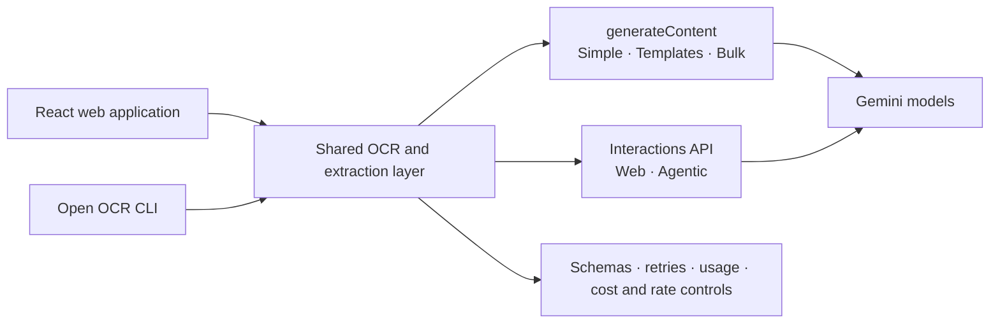

<!-- markdownlint-disable MD013 -->

# Open Gemini OCR

## Document extraction for people, pipelines, and difficult scans

Extract text and structured data from images, PDFs, and public URLs with a
polished React application and a production-oriented Node.js CLI.

[**Open OCR CLI on npm**](https://www.npmjs.com/package/open-ocr-cli)
· [**Latest release**](https://github.com/cyanxxy/gemini-ocr/releases/latest)
· [**Report an issue**](https://github.com/cyanxxy/gemini-ocr/issues)

[](https://github.com/cyanxxy/gemini-ocr/actions/workflows/ci.yml)
[](https://www.npmjs.com/package/open-ocr-cli)
[](https://github.com/cyanxxy/gemini-ocr/releases)
[](package.json)
[](LICENSE)

> [!NOTE]
> **Open Gemini OCR** is the web application and repository. The npm package is
> **Open OCR CLI** (`open-ocr-cli`). The previous `gemini-ocr` executable remains
> available as a backwards-compatible alias.

## Why this project

Open Gemini OCR provides one extraction engine through two interfaces:

| Web application | Open OCR CLI |
| --- | --- |
| Interactive, responsive workflows | Repeatable document pipelines |
| Simple, template, bulk, Web, and agentic modes | Files, directories, globs, URLs, and binary stdin |
| Light, dark, and AMOLED themes | Markdown, JSON, CSV, and JSONL output |
| Local browser settings and previews | Resume manifests, batch audits, cost limits, and rate control |

The project is designed to fail clearly. Truncated model responses are rejected,
unverifiable URL retrieval is not presented as extracted content, and the CLI
checks output conflicts before starting paid model work.

## Workflows

| Workflow | Web route | CLI | Best for |
| --- | --- | --- | --- |
| **Simple OCR** | `/` | `extract --mode simple` | General text, layout, equations, and image descriptions |
| **Template OCR** | `/templates` | `extract --preset <id>` | Invoices, receipts, resumes, and business cards |
| **Bulk OCR** | `/advanced` | `extract <inputs...>` | Multi-document jobs and automation |
| **Web OCR** | `/web` | `web <urls...>` | Grounded extraction from public URLs |
| **Agentic OCR** | `/agentic` | `extract --mode agentic` | Iterative field recovery and targeted re-OCR |

Built-in templates produce normalized records and, where applicable, table data
for line items. The CLI also accepts custom JSON Schemas and validates both the
schema and the returned value locally.

## Quick start

### Requirements

- Node.js **20.19+**, **22.13+**, or **24+**
- A Gemini API key from [Google AI Studio](https://aistudio.google.com/app/apikey)

### Run the web application

```bash
git clone https://github.com/cyanxxy/gemini-ocr.git
cd gemini-ocr
npm ci
npm run dev
```

Open `http://localhost:5173`, choose **Settings**, and add your Gemini API key.
For a first run, use **Simple OCR** for a document or **Templates** for an
invoice, receipt, resume, or business card.

### Install Open OCR CLI

```bash
npm install --global open-ocr-cli
export GEMINI_API_KEY="your-key"
open-ocr-cli doctor
open-ocr-cli extract invoice.pdf
```

PowerShell:

```powershell
$env:GEMINI_API_KEY="your-key"
open-ocr-cli doctor
```

The CLI also loads `GEMINI_API_KEY` from a project-local `.env` file. It never
accepts an API key as a command-line flag or raw configuration value.

## Open OCR CLI

The CLI is published as
[`open-ocr-cli`](https://www.npmjs.com/package/open-ocr-cli) and installs two
equivalent commands:

```text
open-ocr-cli   Primary command
gemini-ocr     Backwards-compatible alias
```

### Useful commands

```bash
# Guided project configuration and credential validation
open-ocr-cli init

# A recursive, resumable batch
open-ocr-cli extract ./documents \
  --output ./results \
  --concurrency 4 \
  --resume

# Structured invoice artifacts
open-ocr-cli extract ./invoices \
  --preset invoice \
  --format all \
  --output ./invoice-results

# Custom structured output
open-ocr-cli extract invoice.pdf \
  --schema examples/invoice.schema.json \
  --output invoice.json

# Grounded public-URL extraction
open-ocr-cli web https://example.com/report.pdf --format markdown

# Validate the complete plan without credentials, API calls, or writes
open-ocr-cli extract ./documents --dry-run

# Audit a completed or interrupted batch
open-ocr-cli status ./results
open-ocr-cli status ./results --json
```

Inputs can be individual files, recursive directories, shell globs, public URLs,
or binary stdin. Progress and diagnostics go to `stderr`; extracted content and
JSONL events stay on `stdout`, so the command is safe to compose in pipelines.

For the complete command reference, configuration keys, batch semantics, and
exit codes, see the [CLI package guide](packages/cli/README.md).

### Configuration precedence

Configuration is merged from lowest to highest priority:

1. `~/.config/gemini-ocr/config.json`
2. `./.gemini-ocr.json`
3. `--config <path>`
4. Command-line flags

These legacy-compatible paths intentionally retain the `gemini-ocr` name.
Configuration stores only the environment-variable name used for credentials.

## Reliability by design

| Contract | Behavior |
| --- | --- |
| **Complete responses only** | Non-terminal streams, blocked responses, `MAX_TOKENS`, and unsuccessful interactions fail closed. |
| **Preflight before spend** | Inputs, schemas, output occupancy, and same-stem collisions are checked before extraction begins. |
| **No silent document loss** | Every discovered input receives a succeeded, partial, failed, or skipped result. |
| **Safe batch ownership** | An exclusive output lock prevents concurrent processes from racing manifest updates. |
| **Recoverable batches** | Fingerprinted manifests support `--resume`; `status` audits artifacts, usage, locks, and source drift. |
| **No-clobber output** | Existing artifacts require `--overwrite`; unsupported hard links fall back to exclusive writes. |
| **Bounded API use** | Request spacing, retries, timeouts, concurrency, estimated-cost ceilings, and abort signals share one policy. |
| **Pipeline-safe streams** | Machine-readable results use `stdout`; human diagnostics use `stderr`. |

Multi-artifact writes use staging and exception rollback. They are deliberately
documented as best-effort across process crashes or power loss, not as an ACID
filesystem transaction.

## Architecture

The browser application and CLI share extraction logic, templates, usage
accounting, request controls, and the agent loop.



Agentic OCR uses a two-loop design:

- An outer document loop evaluates confidence and coverage.
- An inner interaction loop lets Gemini request one tool, inspect its result,
  and decide the next action.
- The original document is sent once; stored interaction chaining carries
  context into later tool rounds.
- Structure analysis, batch field extraction, validation, and targeted region
  re-OCR update a local audit transcript and agent memory.

## Models and reasoning

The current release accepts these model IDs:

| Model | Project role | Thinking levels |
| --- | --- | --- |
| `gemini-3.5-flash` | Default; recommended for most documents | MINIMAL · LOW · MEDIUM · HIGH |
| `gemini-3.1-flash-lite` | Lower-cost, high-volume extraction | MINIMAL · LOW · MEDIUM · HIGH |
| `gemini-3-flash-preview` | Preview Flash option | MINIMAL · LOW · MEDIUM · HIGH |
| `gemini-3.1-pro-preview` | Highest-reasoning option | LOW · MEDIUM · HIGH |

The application default is **MEDIUM**. Agentic mode raises `MINIMAL` to
`MEDIUM`, and unsupported levels are clamped to a model-compatible value.

## Inputs, outputs, and limits

| Constraint | Current limit |
| --- | --- |
| Local formats | PNG · JPEG · WebP · HEIC · HEIF · PDF |
| Image input | 70 MB raw |
| PDF input | 50 MB and up to 1,000 pages |
| Web-app bulk queue | 200 files and 500 MB total |
| CLI batch defaults | 1,000 files and 5,120 MB total; configurable |
| CLI concurrency | 2 by default; configurable from 1–16 |
| Web OCR | Up to 20 public HTTP(S) URLs per request |
| Output | Markdown · JSON · CSV · JSONL · agent audit steps |

Web OCR rejects credentials in URLs, localhost, private network ranges, and
common tunnel hosts. It verifies retrieval metadata per URL and reports failed
or unverifiable grounding instead of generating substitute content.

## Security and privacy

> [!IMPORTANT]
> The browser stores the API key in `localStorage` with light obfuscation, not
> strong encryption. Anyone with access to that browser profile can recover it.

- There is no application backend and no telemetry service. Documents are sent
  directly to the Gemini API using the key supplied by the user.
- The CLI reads credentials from the environment and never serializes the raw
  key into its configuration or batch metadata.
- Agentic mode uses stored Gemini Interactions so later rounds can reference the
  original document. Those interactions follow Google's
  [data-retention policy](https://ai.google.dev/gemini-api/docs/interactions).
- One-shot Web OCR explicitly disables interaction storage.
- File signatures, MIME types, sizes, PDF page counts, URL schemes, and custom
  schemas are validated before use.
- Production builds omit source maps and ship CSP and other hardening headers
  through the included Netlify and Vercel configuration.

Use a trusted browser profile, rotate exposed keys, and prefer a backend proxy
when deploying with organization-owned credentials. See [SECURITY.md](SECURITY.md)
for private vulnerability reporting.

## Development

### Quality commands

```bash
npm run typecheck
npm run lint
npm test
npm run build
npm run evals:validate
```

| Command | Purpose |
| --- | --- |
| `npm run dev` | Start the Vite development server |
| `npm run build` | Create the production web build |
| `npm run preview` | Preview the production build |
| `npm run typecheck` | Check browser, Node, and CLI TypeScript projects |
| `npm run lint` | Run ESLint |
| `npm test` | Run the Vitest suite |
| `npm run test:coverage` | Run tests with coverage thresholds |
| `npm run cli -- extract …` | Run the TypeScript CLI locally |
| `npm run cli:smoke` | Build and smoke-test the packaged executable |
| `npm run cli:pack` | Create the standalone npm tarball |
| `npm run evals:validate` | Validate evaluation cases and corpus metadata |
| `npm run evals:canary` | Run the small live Gemini evaluation suite |
| `npm run evals` | Run the complete live evaluation suite |

CI runs typechecking, linting, tests with coverage, dependency auditing,
evaluation-fixture validation, and the production build. Version tags run the
release gates again before GitHub publishes an artifact.

### Project layout

```text
src/
  cli/            Commands, discovery, orchestration, artifacts, status
  components/     Reusable UI from atoms through page-level organisms
  pages/          Simple, Templates, Web, Bulk, and Agentic workflows
  lib/
    gemini/       Client, extraction, Interactions, usage, request policy
    templates/    Structured extraction presets and rendering
    agent*.ts     Agent loop, tools, prompts, memory, and audit steps
  store/          Zustand settings and workflow stores
  hooks/          Shared React hooks
  design/         Theme tokens
evals/            Reproducible OCR quality and regression evaluations
packages/cli/     Publishable Open OCR CLI package
```

### AI evaluations

The evaluation suite measures character and word error rates, edit similarity,
coverage, unsupported text, structured-field precision/recall/F1, critical-field
exact match, table-cell F1, latency, and per-mode breakdowns.

```bash
npm run evals:fixtures
npm run evals:setup
npm run evals:validate
GEMINI_API_KEY=your_key npm run evals:canary
GEMINI_API_KEY=your_key npm run evals
npm run evals:report
```

Public benchmark downloads and timestamped raw outputs remain local and
untracked. The committed [latest report](evals/reports/latest.md) is a historical
snapshot; its header states when it needs regeneration. See
[evals/README.md](evals/README.md) for datasets, scoring, and reproduction steps.

## Deployment

`npm run build` produces a static application in `dist/`. Deployment
configuration is included for Netlify and Vercel. Release tags also attach a
production build archive to the corresponding
[GitHub release](https://github.com/cyanxxy/gemini-ocr/releases).

## Contributing

Contributions are welcome. Start with [CONTRIBUTING.md](CONTRIBUTING.md), follow
the community expectations in [CODE_OF_CONDUCT.md](CODE_OF_CONDUCT.md), and
include tests or evaluation evidence for behavior changes.

- [Open issues](https://github.com/cyanxxy/gemini-ocr/issues)
- [Release history](CHANGELOG.md)
- [Security policy](SECURITY.md)

## License

Released under the [MIT License](LICENSE).
