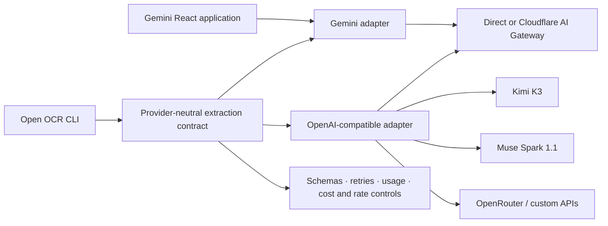

<!-- markdownlint-disable MD013 -->

# Open OCR CLI

## Multimodal document extraction that does not lock you to one model

Extract text and structured data from images, PDFs, and public URLs with a
production-oriented Node.js CLI. Use Gemini directly, Kimi K3, Meta Muse
Spark 1.1, OpenRouter, any compatible endpoint, or route requests through
Cloudflare AI Gateway. The repository also contains the original Gemini-powered
React application.

[**Open OCR CLI on npm**](https://www.npmjs.com/package/open-ocr-cli)
· [**Latest release**](https://github.com/cyanxxy/gemini-ocr/releases/latest)
· [**Report an issue**](https://github.com/cyanxxy/gemini-ocr/issues)

[](https://github.com/cyanxxy/gemini-ocr/actions/workflows/ci.yml)
[](https://www.npmjs.com/package/open-ocr-cli)
[](https://github.com/cyanxxy/gemini-ocr/releases)
[](package.json)
[](LICENSE)

> [!NOTE]
> **Open OCR CLI** (`open-ocr-cli`) is the primary product and npm package. The
> previous `gemini-ocr` executable and configuration paths remain compatible.
> Provider-neutral support currently applies to the CLI; the bundled browser
> application continues to use Gemini.

## Why this project

The project provides a provider-neutral CLI plus a polished Gemini web app:

| Gemini web application | Open OCR CLI |
| --- | --- |
| Interactive, responsive workflows | Repeatable document pipelines |
| Simple, template, bulk, Web, and agentic modes | Files, directories, globs, URLs, and binary stdin |
| Light, dark, and AMOLED themes | Markdown, JSON, CSV, and JSONL output |
| Local browser settings and previews | Gemini · Kimi · Muse · OpenRouter · compatible APIs · Cloudflare Gateway |

The project is designed to fail clearly. Truncated model responses are rejected,
unverifiable URL retrieval is not presented as extracted content, and the CLI
checks output conflicts before starting paid model work.

## Workflows

| Workflow | Web route | CLI | Best for |
| --- | --- | --- | --- |
| **Simple OCR** | `/` | `extract --mode simple` | General text, layout, equations, and image descriptions |
| **Template OCR** | `/templates` | `extract --preset <id>` | Invoices, receipts, resumes, and business cards |
| **Bulk OCR** | `/advanced` | `extract <inputs...>` | Multi-document jobs and automation |
| **Web OCR** | `/web` | `web <urls...>` | Grounded extraction from public URLs |
| **Agentic OCR** | `/agentic` | `extract --mode agentic` | Iterative field recovery and targeted re-OCR |

Built-in templates produce normalized records and, where applicable, table data
for line items. The CLI also accepts custom JSON Schemas and validates both the
schema and the returned value locally.

## Quick start

### Requirements

- Node.js **20.19+**, **22.13+**, or **24+**
- A key for at least one supported provider; `--dry-run` needs no credentials

### Run the web application

```bash
git clone https://github.com/cyanxxy/gemini-ocr.git
cd gemini-ocr
npm ci
npm run dev
```

Open `http://localhost:5173`, choose **Settings**, and add your Gemini API key.
For a first run, use **Simple OCR** for a document or **Templates** for an
invoice, receipt, resume, or business card.

### Install Open OCR CLI

```bash
npm install --global open-ocr-cli
export GEMINI_API_KEY="your-key"
open-ocr-cli
```

Running `open-ocr-cli` with no arguments in an interactive terminal opens the
guided menu. Use the arrow keys to choose Extract, Web, Init, Providers, Models,
Presets, Doctor, Status, or Help; press Enter to confirm and Ctrl-C to cancel.
When stdin or the prompt stream is not a TTY, the bare command prints help
instead. If you installed the package locally with `npm install open-ocr-cli`,
run `npx open-ocr-cli` instead.

PowerShell:

```powershell
$env:GEMINI_API_KEY="your-key"
open-ocr-cli doctor
```

Docker and GitHub Actions are supported too:

```bash
docker run --rm -v "$PWD:/work" \
  -e GEMINI_API_KEY \
  ghcr.io/cyanxxy/open-ocr-cli:latest \
  extract /work/invoice.pdf --output /work/results
```

```yaml
- uses: cyanxxy/gemini-ocr@v2
  with:
    inputs: invoices
    provider: openrouter
    model: moonshotai/kimi-k3
    format: all
    output: ocr-results
    # Set dry-run: true to validate a workflow without secrets or API calls.
  env:
    OPENROUTER_API_KEY: ${{ secrets.OPENROUTER_API_KEY }}
```

Tagged releases include the npm tarball and a generated `open-ocr-cli.rb`
Homebrew formula. npm releases are published from GitHub Actions with provenance,
and the same release builds the multi-architecture container image.

Maintainers can follow the [release checklist](docs/releasing.md) and the
[30-day launch playbook](docs/launch-playbook.md).

Or choose a different provider:

```bash
export MOONSHOT_API_KEY="your-key"
open-ocr-cli extract invoice.pdf --provider kimi

export OPENROUTER_API_KEY="your-key"
open-ocr-cli extract invoice.pdf \
  --provider openrouter \
  --model moonshotai/kimi-k3
```

The CLI loads provider credentials from the environment or a project-local
`.env`. It never accepts a raw API key as a flag or configuration value.

## CLI reference

The CLI is published as
[`open-ocr-cli`](https://www.npmjs.com/package/open-ocr-cli) and installs two
equivalent commands:

```text
open-ocr-cli   Primary command
gemini-ocr     Backwards-compatible alias
```

Coding agents should use the versioned, reference-first interface:

```bash
open-ocr-cli capabilities --json
open-ocr-cli run --request request.json --response-format jsonl
```

The CLI validates request/result/event schemas, emits stable typed errors, and
keeps large OCR bodies in referenced artifacts. The shared Codex/Claude Code
workflow is in
[`integrations/open-ocr/skills/open-ocr/SKILL.md`](integrations/open-ocr/skills/open-ocr/SKILL.md).
It is also included in the npm package under `skills/open-ocr/`.

### Useful commands

```bash
# Guided command menu (also available as `open-ocr-cli interactive`)
open-ocr-cli

# Guided project configuration and credential validation
open-ocr-cli init

# A recursive, resumable batch
open-ocr-cli extract ./documents \
  --output ./results \
  --concurrency 4 \
  --resume

# Structured invoice artifacts
open-ocr-cli extract ./invoices \
  --preset invoice \
  --format all \
  --output ./invoice-results

# Custom structured output
open-ocr-cli extract invoice.pdf \
  --schema examples/invoice.schema.json \
  --output invoice.json

# Grounded public-URL extraction
open-ocr-cli web https://example.com/report.pdf --format markdown

# Validate the complete plan without credentials, API calls, or writes
open-ocr-cli extract ./documents --dry-run

# Audit a completed or interrupted batch
open-ocr-cli status ./results
open-ocr-cli status ./results --json

# Discover provider profiles and recommended model IDs
open-ocr-cli providers
open-ocr-cli models --provider openrouter
```

Inputs can be individual files, recursive directories, shell globs, public URLs,
or binary stdin. Progress and diagnostics go to `stderr`; extracted content and
JSONL events stay on `stdout`, so the command is safe to compose in pipelines.
Direct `extract --jsonl` preserves the established document-record stream for
existing scripts. `run --response-format jsonl` is the versioned agent protocol
and emits ordered lifecycle events; protocol v2 is current and v1 remains a
compatibility contract. Use `--no-config` or `OPEN_OCR_NO_CONFIG=1` for a
hermetic run that ignores config files and the project `.env`.
Direct subcommands never prompt unless the command itself is interactive, so
existing scripts and CI workflows keep deterministic behavior.

For the complete command reference, configuration keys, batch semantics, and
exit codes, see the [CLI package guide](packages/cli/README.md).

### Providers and gateways

| Provider profile | Default model | Documents | Structured output | Agent tools |
| --- | --- | --- | --- | --- |
| `gemini` | `gemini-3.5-flash` | Images and native PDFs | Yes | Native Interactions API |
| `kimi` | `kimi-k3` | Images; PDFs through Kimi file extraction | Yes | OpenAI-compatible tool calls |
| `muse` | `muse-spark-1.1` | PNG, JPEG, WebP, GIF images and PDFs | Yes | OpenAI-compatible tool calls |
| `openrouter` | `google/gemini-3.5-flash` | Model-dependent images and PDFs | Model-dependent | Model-dependent |
| `openai-compatible` | Required | Images; PDF capability is not assumed | Endpoint-dependent | Endpoint-dependent |

Named profiles supply sensible endpoints, credential names, and multimodal
wire formats. `openrouter` and `openai-compatible` accept arbitrary upstream
model IDs. Muse Spark is a public-preview API, so `--base-url` remains available
if Meta changes its endpoint before general availability. Muse PDFs use Meta's
documented Chat Completions `{ type: "file", file: { filename, file_data } }`
shape. Muse agentic tool loops run on Chat Completions and do not carry private
chain-of-thought across turns for external API keys (prefer Gemini or Kimi when
deep multi-iteration reasoning continuity matters).

Structured extraction keeps the same fail-closed contract across providers.
Direct Kimi requests use Moonshot Flavoured JSON Schema strict mode, which
supports optional properties. Other named routes receive `strict: true` only
when the supplied schema satisfies the narrower all-properties-required strict
dialect; an arbitrary `openai-compatible` endpoint is not falsely claimed to
support `strict`. In every case the CLI validates the returned value against the
original schema locally. Invalid JSON or a schema mismatch is never persisted
as a successful extraction.

The implementations follow the providers' public contracts:
[Kimi K3 and its OpenAI-compatible API](https://platform.kimi.ai/docs/guide/kimi-k3-quickstart),
[Kimi model catalog](https://platform.kimi.ai/docs/models),
[Meta Muse Spark 1.1](https://ai.meta.com/blog/introducing-muse-spark-meta-model-api/),
[OpenRouter multimodal files](https://openrouter.ai/docs/guides/overview/multimodal/pdfs),
[OpenRouter tool calling](https://openrouter.ai/docs/guides/features/tool-calling), and
[Cloudflare AI Gateway chat compatibility](https://developers.cloudflare.com/ai-gateway/usage/chat-completion/).

Cloudflare is a route, not a model provider. The same OCR flow can run directly
or through a named gateway:

```bash
export GEMINI_API_KEY="your-key"
export CLOUDFLARE_AI_GATEWAY_TOKEN="gateway-token"

open-ocr-cli extract invoice.pdf \
  --provider gemini \
  --gateway cloudflare \
  --cloudflare-account-id "$CLOUDFLARE_ACCOUNT_ID" \
  --cloudflare-gateway-id "$CLOUDFLARE_AI_GATEWAY_ID"
```

OpenRouter uses Cloudflare's native OpenRouter route. Kimi, Muse, and generic
endpoints use a configured Cloudflare custom-provider slug:

```bash
open-ocr-cli extract invoice.pdf \
  --provider kimi \
  --gateway cloudflare \
  --cloudflare-account-id "$CLOUDFLARE_ACCOUNT_ID" \
  --cloudflare-gateway-id "$CLOUDFLARE_AI_GATEWAY_ID" \
  --cloudflare-provider moonshot
```

Configure that Cloudflare custom provider with the upstream base before
`/v1`—for example `https://api.moonshot.ai` for Kimi. The CLI forwards the
remaining `/v1/chat/completions` or `/v1/files` path through the custom route.

Add `--cloudflare-byok` when the provider key is stored in the gateway, and
optionally select it with `--cloudflare-byok-alias`. See Cloudflare's
[gateway authentication](https://developers.cloudflare.com/ai-gateway/configuration/authentication/)
and [stored-key documentation](https://developers.cloudflare.com/ai-gateway/configuration/bring-your-own-keys/).
Unauthenticated gateways do not require a gateway token. When authentication is
enabled in the Cloudflare dashboard, set `CLOUDFLARE_AI_GATEWAY_TOKEN` (or use
`--cloudflare-token-env` to name another environment variable). BYOK gateways
are authenticated by definition, so the token is mandatory in BYOK mode.

### Configuration precedence

Configuration is merged from lowest to highest priority:

1. `~/.config/gemini-ocr/config.json` (legacy)
2. `~/.config/open-ocr-cli/config.json`
3. `./.gemini-ocr.json` (legacy)
4. `./.open-ocr-cli.json`
5. `--config <path>`
6. Command-line flags

Configuration stores only the environment-variable name used for credentials.

```json
{
  "provider": "openrouter",
  "model": "moonshotai/kimi-k3",
  "gateway": "direct",
  "apiKeyEnv": "OPENROUTER_API_KEY",
  "concurrency": 4,
  "requestsPerMinute": 60,
  "resume": true
}
```

## Reliability by design

| Contract | Behavior |
| --- | --- |
| **Complete responses only** | Non-terminal streams, blocked responses, `MAX_TOKENS`, and unsuccessful interactions fail closed. |
| **Preflight before spend** | Inputs, schemas, output occupancy, and same-stem collisions are checked before extraction begins. |
| **No silent document loss** | Every discovered input receives a succeeded, partial, failed, or skipped result. |
| **Safe batch ownership** | An exclusive output lock prevents concurrent processes from racing manifest updates. |
| **Recoverable batches** | Fingerprinted manifests support `--resume`; `status` audits artifacts, usage, locks, and source drift. |
| **No-clobber output** | Existing artifacts require `--overwrite`; unsupported hard links fall back to exclusive writes. |
| **Bounded API use** | Request spacing, retries, timeouts, concurrency, estimated-cost ceilings, and abort signals share one policy. |
| **Pipeline-safe streams** | Machine-readable results use `stdout`; human diagnostics use `stderr`. |

Multi-artifact writes use staging and exception rollback. They are deliberately
documented as best-effort across process crashes or power loss, not as an ACID
filesystem transaction.

## Architecture

The CLI's extraction contract sits above provider adapters, so schema
validation, templates, batching, retry policy, manifests, usage, and output
semantics do not change when a model route changes.



Agentic OCR uses a two-loop design:

- An outer document loop evaluates confidence and coverage.
- An inner interaction loop lets the selected model request one tool, inspect its result,
  and decide the next action.
- The original document is sent once. Gemini uses stored interaction chaining;
  compatible providers use a local message transcript and preserve Kimi
  `reasoning_content` and OpenRouter `reasoning_details` across tool
  continuations.
- Structure analysis, batch field extraction, validation, and targeted region
  re-OCR update a local audit transcript and agent memory.

## Models, reasoning, and cost

Gemini model IDs are validated because their thinking and pricing contracts are
known. Other profiles accept upstream model IDs, with these recommended defaults:

| Model | Project role | Thinking levels |
| --- | --- | --- |
| `gemini-3.5-flash` | Default; recommended for most documents | MINIMAL · LOW · MEDIUM · HIGH |
| `gemini-3.1-flash-lite` | Lower-cost, high-volume extraction | MINIMAL · LOW · MEDIUM · HIGH |
| `gemini-3-flash-preview` | Preview Flash option | MINIMAL · LOW · MEDIUM · HIGH |
| `gemini-3.1-pro-preview` | Highest-reasoning option | LOW · MEDIUM · HIGH |
| `kimi-k3` | Default Kimi multimodal and agentic route | LOW · HIGH · MAX |
| `kimi-k2.7-code` | Kimi coding/agent route; thinking is always enabled | HIGH (enabled; no configurable effort) |
| `kimi-k2.7-code-highspeed` | Faster Kimi K2.7 Code route with the same parameter contract | HIGH (enabled; no configurable effort) |
| `kimi-k2.6` | Legacy Kimi multimodal route | MINIMAL (instant) · HIGH (thinking) |
| `muse-spark-1.1` | Meta public-preview multimodal route | MINIMAL · LOW · MEDIUM · HIGH · XHIGH |
| `moonshotai/kimi-k3` | Kimi through OpenRouter | LOW · HIGH · MAX |
| Other OpenRouter models | Upstream model selected by ID | model-dependent; MINIMAL · LOW · MEDIUM · HIGH · XHIGH · MAX are accepted by the router |

Gemini defaults are model-aware: 3.5 Flash uses **MEDIUM**, Flash-Lite uses
**MINIMAL**, and 3 Flash Preview / 3.1 Pro use **HIGH**. Explicit supported
levels are preserved in agentic mode instead of being silently increased.
Kimi K3 defaults to **MAX** and uses its current `reasoning_effort` contract.
K2.7 keeps thinking enabled and rejects fake effort distinctions. Legacy K2.6
uses `MINIMAL` for instant mode and `HIGH` for thinking mode. Muse passes the
configured supported level through as `reasoning_effort` without rewriting it.
OpenRouter's unified reasoning interface maps an effort to the closest level
supported by the selected model; Kimi K3 routes are validated more narrowly as
LOW, HIGH, or MAX. Non-Gemini compatible routes accept `--max-tokens` up to the
protocol ceiling of 1,048,576 so the CLI does not impose an obsolete model
limit; an upstream model can still enforce a smaller advertised maximum.

Use `--progress off|standard|detailed` (or `extraction.progress` in a protocol
v2 request) to choose observability. V2 JSONL emits typed, ordered progress
steps: standard preserves model output, provider thought summaries, and tool
lifecycle metadata; detailed additionally exposes provider reasoning and tool
payloads. Reasoning state needed for a tool continuation is always replayed to
the provider regardless of visibility. The deprecated `--include-thoughts`
flag maps to standard progress (tool payloads stay opt-in via `--progress detailed`).
Terminal output and protocol v1 retain bounded,
single-line display messages for compatibility; those are not the v2 machine
contract.

Built-in paid-tier estimates use USD per million tokens:

| Model | Input | Cached input | Output and reasoning |
| --- | ---: | ---: | ---: |
| `gemini-3.5-flash` | $1.50 | $0.15 | $9.00 |
| `gemini-3.1-flash-lite` | $0.25 | $0.025 | $1.50 |
| `gemini-3-flash-preview` | $0.50 | $0.05 | $3.00 |
| `gemini-3.1-pro-preview` | $2.00 / $4.00 above 200K input tokens | $0.20 / $0.40 | $12.00 / $18.00 |
| `kimi-k3` | $3.00 | $0.30 | $15.00 |
| `kimi-k2.7-code` | $0.95 | $0.19 | $4.00 |
| `kimi-k2.7-code-highspeed` | $1.90 | $0.38 | $8.00 |
| `kimi-k2.6` | $0.95 | $0.16 | $4.00 |

OpenRouter-reported cost is used when present. Provider prices can change, so
verify the linked provider pages before budgeting a large run. For an unknown
or custom model—or Muse Spark while its public-preview pricing is not available
in public primary documentation—set both `--input-price` and `--output-price`
if `--max-cost` must be enforceable.

## Inputs, outputs, and limits

| Constraint | Current limit |
| --- | --- |
| CLI local formats | PNG · JPEG · WebP · GIF · HEIC · HEIF · PDF |
| Image input | 70 MB raw |
| PDF input | 50 MB and up to 1,000 pages |
| Web-app bulk queue | 200 files and 500 MB total |
| CLI batch defaults | 1,000 files and 5,120 MB total; configurable |
| CLI concurrency | 2 by default; configurable from 1–16 |
| Web OCR | Up to 20 public HTTP(S) URLs per request |
| Output | Markdown · JSON · CSV · JSONL · agent audit steps |

Video is outside this OCR CLI's input contract. Files such as MP4 are rejected
even when the selected foundation model has a broader video capability; video
signatures appear in tests only to prove they are not misidentified as HEIC or
HEIF images.

HEIC and HEIF are sent natively through Gemini. The named Kimi, Muse, and
OpenRouter profiles accept PNG, JPEG, WebP, and GIF through this CLI,
so they reject HEIC/HEIF locally with a conversion hint instead of speculating
about an undocumented transport format after an API call.
Agents can discover the CLI/provider intersection from each known profile's
`inputImageMimeTypes` field in `open-ocr-cli capabilities --json`; an omitted
field means the accepted formats depend on the selected model or endpoint.

Web OCR rejects credentials in URLs, localhost, private network ranges, and
common tunnel hosts. Gemini uses verified URL Context metadata. Other providers
use the CLI's bounded downloader, reject non-public IPv4 and IPv6 addresses
(including IPv4-mapped IPv6), pin DNS across redirects, and stop sockets after
30 seconds without network activity. HTML is converted with a structure-aware
text parser before the retrieved content is sent to the selected model.

## Security and privacy

> [!IMPORTANT]
> The browser stores the API key in `localStorage` with light obfuscation, not
> strong encryption. Anyone with access to that browser profile can recover it.

- There is no application backend and no telemetry service. CLI documents are
  sent to the selected provider or gateway; the web app sends them to Gemini.
- The CLI reads credentials from the environment and never serializes the raw
  key into its configuration or batch metadata.
- Agentic mode uses stored Gemini Interactions so later rounds can reference the
  original document. Those interactions follow Google's
  [data-retention policy](https://ai.google.dev/gemini-api/docs/interactions).
- One-shot Web OCR explicitly disables interaction storage.
- File signatures, MIME types, sizes, PDF page counts, URL schemes, and custom
  schemas are validated before use.
- Production builds omit source maps and ship CSP and other hardening headers
  through the included Netlify and Vercel configuration.

Use a trusted browser profile, rotate exposed keys, and prefer a backend proxy
when deploying with organization-owned credentials. See [SECURITY.md](SECURITY.md)
for private vulnerability reporting.

## Development

### Quality commands

```bash
npm run typecheck
npm run lint
npm test
npm run build
npm run evals:validate
```

| Command | Purpose |
| --- | --- |
| `npm run dev` | Start the Vite development server |
| `npm run build` | Create the production web build |
| `npm run preview` | Preview the production build |
| `npm run typecheck` | Check browser, Node, and CLI TypeScript projects |
| `npm run lint` | Run ESLint |
| `npm test` | Run the Vitest suite |
| `npm run test:coverage` | Run tests with coverage thresholds |
| `npm run cli -- extract …` | Run the TypeScript CLI locally |
| `npm run cli:smoke` | Build and smoke-test the packaged executable |
| `npm run cli:pack` | Create the standalone npm tarball |
| `npm run cli:install-smoke` | Install the packed tarball in a clean directory and test both executables |
| `npm run evals:validate` | Validate evaluation cases and corpus metadata |
| `npm run evals:canary` | Run the small live evaluation suite for the configured provider |
| `npm run evals` | Run the complete live provider evaluation suite |
| `npm run evals:matrix -- --suite canary` | Compare the provider matrix from `evals/providers.example.json` |

Pull-request CI runs typechecking, linting, tests with coverage, dependency
auditing, evaluation-fixture validation, and the production build. Push builds
also verify the non-root container and writable `/work` directory. Version tags
run the release gates again before publishing artifacts, and optional repository
secrets enable live Gemini, Kimi, and OpenRouter canaries.

### Project layout

```text
src/
  cli/            Commands, discovery, orchestration, artifacts, status
  components/     Reusable UI from atoms through page-level organisms
  pages/          Simple, Templates, Web, Bulk, and Agentic workflows
  lib/
    gemini/       Native Gemini client, extraction, and Interactions
    providers/    Registry, routing, compatible transport, agent, usage, policy
    templates/    Structured extraction presets and rendering
    agent*.ts     Agent loop, tools, prompts, memory, and audit steps
  store/          Zustand settings and workflow stores
  hooks/          Shared React hooks
  design/         Theme tokens
evals/            Reproducible OCR quality and regression evaluations
packages/cli/     Publishable Open OCR CLI package
```

### AI evaluations

The evaluation suite measures character and word error rates, edit similarity,
coverage, unsupported text, structured-field precision/recall/F1, critical-field
exact match, table-cell F1, latency, and per-mode breakdowns.

```bash
npm run evals:fixtures
npm run evals:setup
npm run evals:validate
EVAL_PROVIDER=gemini GEMINI_API_KEY=your_key npm run evals:canary
EVAL_PROVIDER=kimi MOONSHOT_API_KEY=your_key npm run evals:canary
EVAL_PROVIDER=openrouter OPENROUTER_API_KEY=your_key \
  OPEN_OCR_MODEL=moonshotai/kimi-k3 npm run evals:canary
npm run evals:matrix -- --suite canary
npm run evals:report
```

Public benchmark downloads and timestamped raw outputs remain local and
untracked. The committed [latest report](evals/reports/latest.md) is a historical
snapshot; its header states when it needs regeneration. See
[evals/README.md](evals/README.md) for datasets, scoring, and reproduction steps.

## Deployment

`npm run build` produces a static application in `dist/`. Deployment
configuration is included for Netlify and Vercel. Release tags also attach a
production build archive to the corresponding
[GitHub release](https://github.com/cyanxxy/gemini-ocr/releases).

## Contributing

Contributions are welcome. Start with [CONTRIBUTING.md](CONTRIBUTING.md), follow
the community expectations in [CODE_OF_CONDUCT.md](CODE_OF_CONDUCT.md), and
include tests or evaluation evidence for behavior changes.

- [Open issues](https://github.com/cyanxxy/gemini-ocr/issues)
- [Release history](CHANGELOG.md)
- [Security policy](SECURITY.md)

## License

Released under the [MIT License](LICENSE).
